# Procesverslag

Markdown is een simpele manier om HTML te schrijven.  
Markdown cheat cheet: [Hulp bij het schrijven van Markdown](https://github.com/adam-p/markdown-here/wiki/Markdown-Cheatsheet).

Nb. De standaardstructuur en de spartaanse opmaak van de README.md zijn helemaal prima. Het gaat om de inhoud van je procesverslag. Besteedt de tijd voor pracht en praal aan je website.

Nb. Door _open_ toe te voegen aan een _details_ element kun je deze standaard open zetten. Fijn om dat steeds voor de relevante stuk(ken) te doen.

## Jij

uitwerken voor kick-off werkgroep

### Auteur:

Sven Doejaaren

#### Je startniveau:

De rode piste

#### Je focus:

De website responsive maken

## Je website

uitwerken voor kick-off werkgroep

### Je opdracht:

https://howlongtobeat.com/

#### Screenshots van de eerste pagina (small screen):

Homepagina  
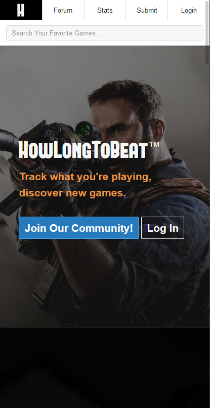
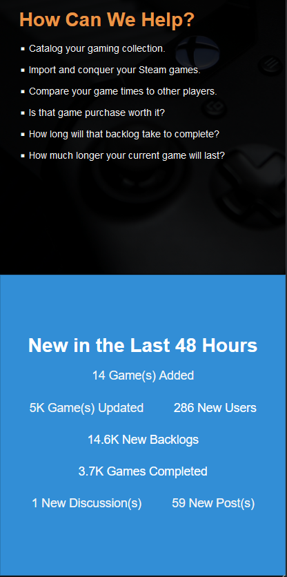
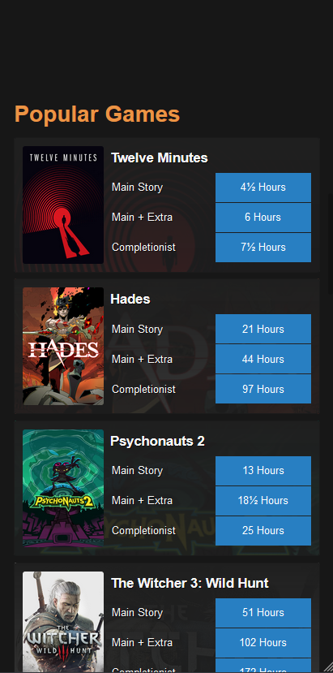
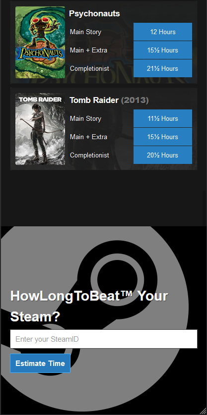
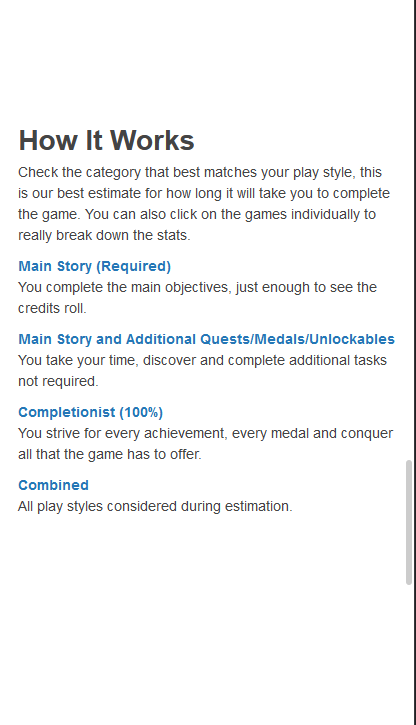
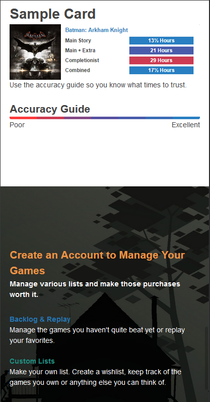
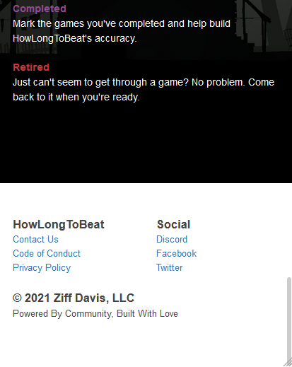

#### Screenshot van de tweede pagina (small screen):

Detailpagina van een spel
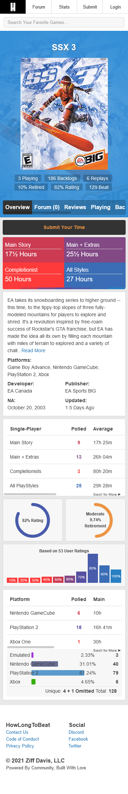

## Breakdownschets (week 1)

uitwerken na afloop 2e werkgroep

### de home pagina:

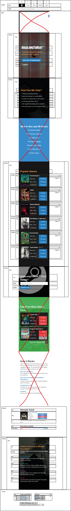

### de detail pagina:

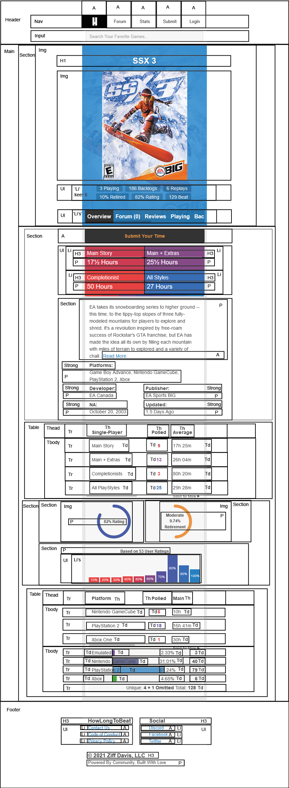

## Voortgang 1 (week 2)

uitwerken voor 1e voortgang

### Stand van zaken

Op dit moment gaat het prima. Ik liep een beetje achter met de breakdownschetsen maar die heb ik nu afgemaakt en in HTML omgezet
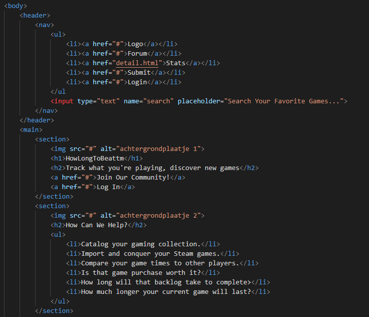
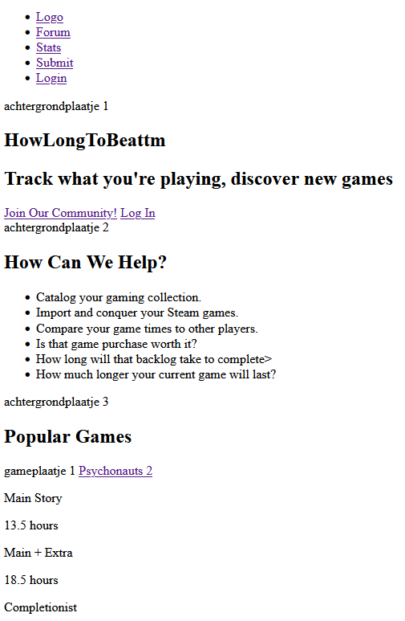
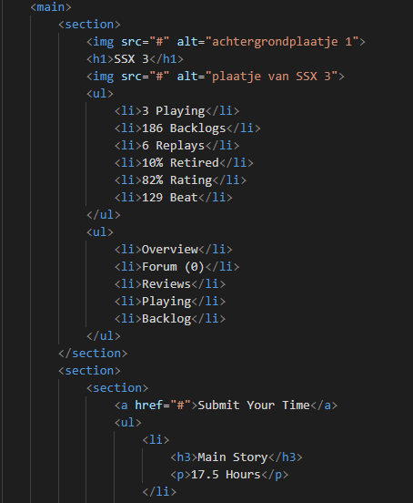
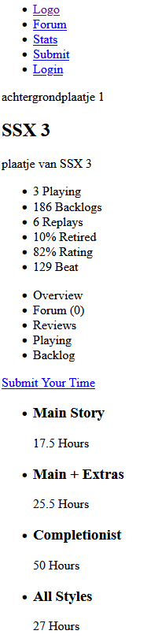

### Agenda voor meeting

samen met je groepje opstellen

| Sven D                                                        | student 2          | student 3    | student 4        |
| ------------------------------------------------------------- | ------------------ | ------------ | ---------------- |
| Mogen wij foto's van de website zelf gebruiken?               | en dit             | en ik dit    | en dan ik dat    |
| Waar bronvermelding plaatsen?                                 | dit als er tijd is | nog een punt | dit wil ik zeker |
| Mijn searchbar wilt niet werken                               | ...                | ...          | ...              |
| 6 keer 'p' vervangen door een Ul?                             |                    |              |                  |
| Welk element gebruiken voor gekleurde lijn bij 'Sample Card'? |                    |              |                  |

### Verslag van meeting

hier na afloop snel de uitkomsten van de meeting vastleggen

- Niet iedereen uit onze groep had voor de vergadering zijn/haar agenda en voortgang op orde
- Desondanks heeft iedereen uit onze groep antwoorden en voorbeelden gekregen op zijn/haar vragen
- We kunnen nu verder aan onze websites

## Voortgang 2 (week 3)

uitwerken voor 2e voortgang

### Stand van zaken

Ik ben begonnen aan de css en javascript van mijn website. Op beide pagina's
zijn de navigatie en de zoekfunctie gestijled en gemaakt. Op alleen de homepgina
is ook de eerste sectie bijna helemaal gestijld.

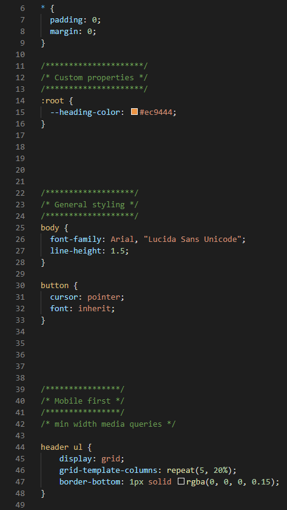
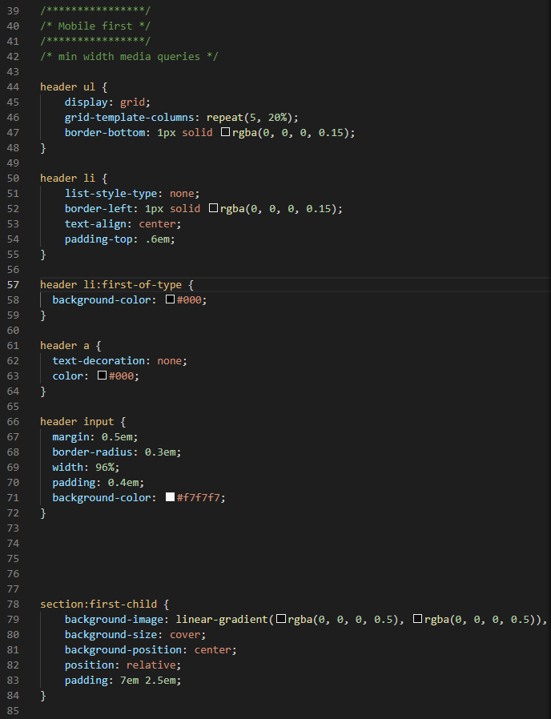
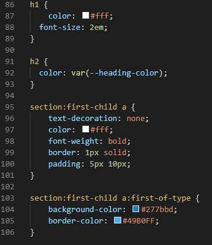
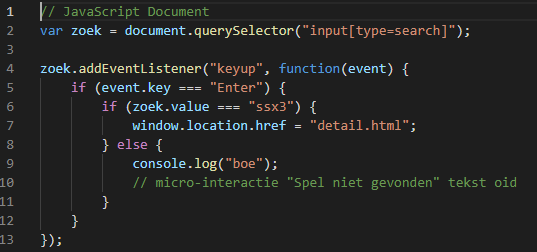
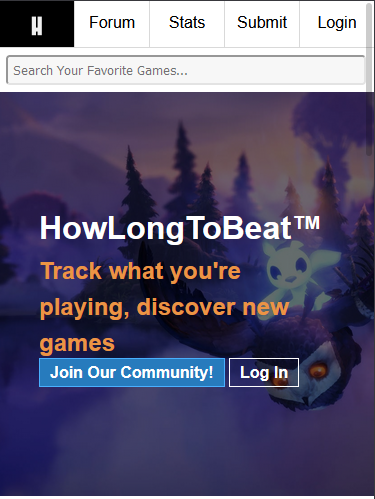

### Agenda voor meeting

samen met je groepje opstellen

| Sven D | student 2 | student 3 | student 4 |
| ------ | --------- | --------- | --------- |

| Zijn er standaard breedtes die worden
gebruikt voor de media queries? En zo ja,
wat zijn deze? | en dit | en ik dit | en dan ik dat |
| en dat ook nog | dit als er tijd is | nog een punt | dit wil ik zeker |
| ... | ... | ... | ... |

### Verslag van meeting

hier na afloop snel de uitkomsten van de meeting vastleggen

- Ik heb een website gelinkt gekregen van de studentassistent waar de meest gangbare media queries/schermbreedtes te vinden zijn die nu in css worden gebruikt. Hier kan ik nu verder mee.
- De andere studenten uit mijn groep hebben hun vragen gesteld en hebben daarop antwoord gekregen, waardoor zij ook verder kunnen met hun website.

## Toegankelijkheidstest (week 4)

uitwerken na test in 8e voortgang

### Bevindingen

Dit zijn de bevindingen die bij mij uit de testen kwamen:

1. Muis en toetsenbord (states)

- Focus state werkt niet overal
- Geen volledige hover state
- Geen visited state
- De active state werkt wel overal

2. Screen readers

- Plaatjes niet meegelezen
- Linkjes, knoppen en invulvelden werden wel meegelezen.

3. Beperkingen

- Teksten zijn niet overal even goed te lezen
- Nav niet genoeg klikbaar
- Search bar misschien te klein
- Footer links misschien te klein?

#### Focus state werk niet overal.

De focus state wordt niet op alle linkjes, knoppen en invoerveld weergegeven op Mac, terwijl dit op Windows wel het geval is. De focus state werkt nog niet op:

- De navigatie
- De titels bij 'Popular games'
- De linkjes in de footer
- De 'Submit' knop op de detail pagina

Toevallig staan bovenstaande elementen allemaal in een 'a' tag.

Hier een omschrijving van hoe het opgelost kan worden (met indien nodig een afbeelding)

Geen idee.

#### Geen volledige hover state.

De hover state werkt nog niet op alle linkjes, knoppen en invoerveld. Dit komt omdat ik mobile first werk en constant mijn website test in de mobiele modus van de browser. De hover state werkt daar niet omdat mobiele telefoons geen hover state hebben. Vandaar dat ik niet overal de hover state heb toegevoegd.

Hier een omschrijving van hoe het opgelost kan worden (met indien nodig een afbeelding)

De hover pseudo-class aan de linkjes, knoppen en het invoerveld toevoegen.

// afbeelding van a:hover css code

#### Geen visited state

Ik heb nergens een visited state toegevoegd. Ik was vergeten dat die bestond.

Ik kan dit oplossen door het :visited pseudo-class aan de linkjes en knoppen toe te voegen.

// afbeelding van hierboven genoemde

#### Plaatjes niet meegelezen

De plaatjes bij 'Popular Games' worden niet door de screenreaders meegelezen.

Ik moet, net zoals op de originele site, de plaatjes in een link zetten. Hierdoor kunnen de plaatjes wel worden meegelezen.

//Afbeelding

#### Teksten zijn niet overal even goed te lezen

Niet alle teksten kunnen goed worden gelezen als ik een bril draag waarin verschillende visuele beperkingen worden gesimuleerd.

Ik zou kunnen kijken of ik de letters groter zou kunnen maken en of dat er goed uitziet op de website.

// Afbeelding

#### Nav niet genoeg klikbaar

De linkjes in de navigatie zijn niet groot genoeg om op te kunnen klikken, terwijl zij er wel zo uitzien.

De vakjes waar zij in staan zijn zo groot vanwege de grootte van de logo.

Ik zou de padding van de linkjes kunnen vergroten en kijken of dat werkt.

// Afbeelding?

#### Search bar misschien te klein

De zoekbalk is wellicht te klein om op te klikken. Dit kan problematisch zijn voor mensen met bijvoorbeeld parkinsons.

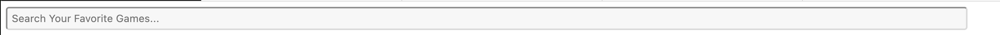

Ik zou de zoekbalk groter kunnen maken en kijken of dat er goed uitziet op de website.

// Afbeelding?

#### Footer links misschien te klein?

De linkjes in de footer zijn wellicht te klein en dit kan problematisch zijn voor mensen met bijvoorbeeld parkinsons.

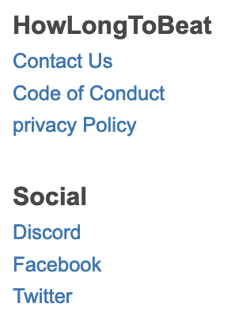

Ik zou de linkjes groter kunnen maken en kijken of dat er goed uitziet op de website.

//Afbeelding

## Voortgang 3 (week 4)

uitwerken voor 3e voortgang

### Stand van zaken

Ik heb de styling van beide pagina's in mobiel formaat afgekregen.
Ik ben begonnen aan de states op beide pagina's te implementeren.
Ik ben nog niet begonnen aan het responsive maken van beide pagina's.

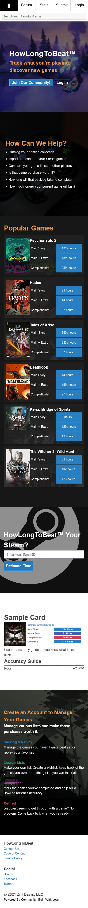
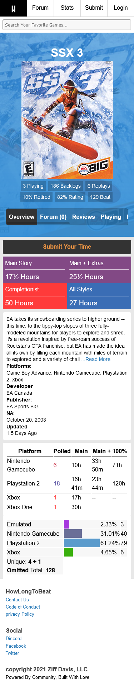

### Agenda voor meeting

samen met je groepje opstellen

| Sven D                      | student 2          | student 3    | student 4        |
| --------------------------- | ------------------ | ------------ | ---------------- |
| Hover op a tags werken niet | en dit             | en ik dit    | en dan ik dat    |
|                             | dit als er tijd is | nog een punt | dit wil ik zeker |
| ...                         | ...                | ...          | ...              |

### Verslag van meeting

hier na afloop snel de uitkomsten van de meeting vastleggen

- punt 1
- punt 2
- nog een punt
- ...

## Eindgesprek (week 5)

uitwerken voor eindgesprek

### Stand van zaken

hier dit ging goed & dit was lastig (neem ook screenshots op van delen van je website en code)

### Screenshot(s)

hier screenshot(s) van je eindresultaat

## Bronnenlijst

continu bijhouden terwijl je werkt

Nb. Wees specifiek ('css-tricks' als bron is bijv. niet specifiek genoeg).

1. bron 1
2. bron 2
3. ...

